# ADTierGuard - Mermaid UML Diagrams

## 1. Component Diagram

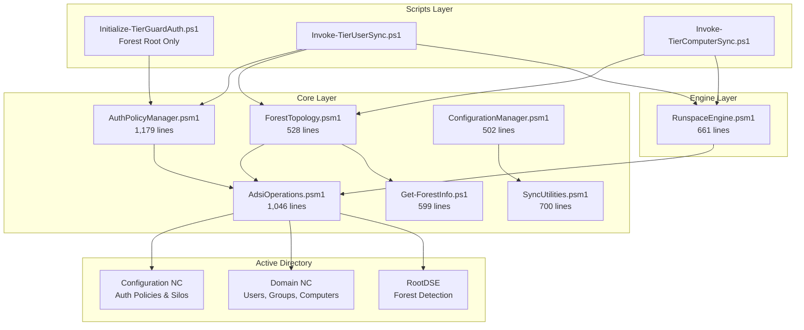

## 2. Class Diagram - Tier Configuration

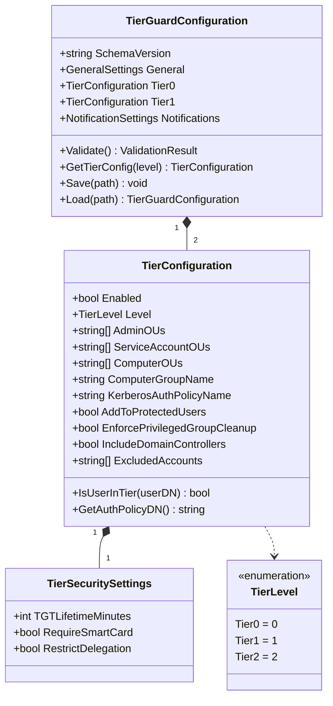

## 3. Class Diagram - Forest Topology

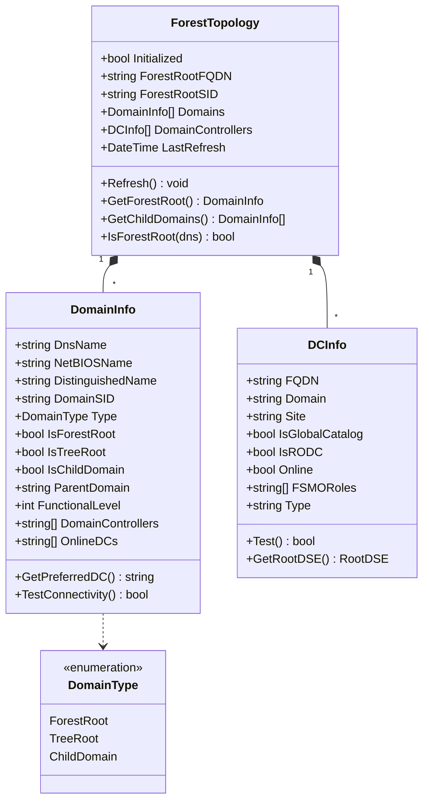

## 4. Class Diagram - Authentication Policy

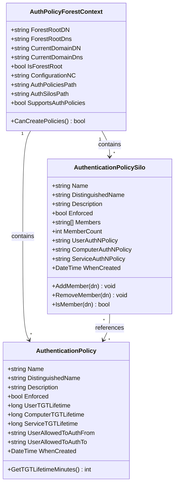

## 5. Class Diagram - Runspace Engine

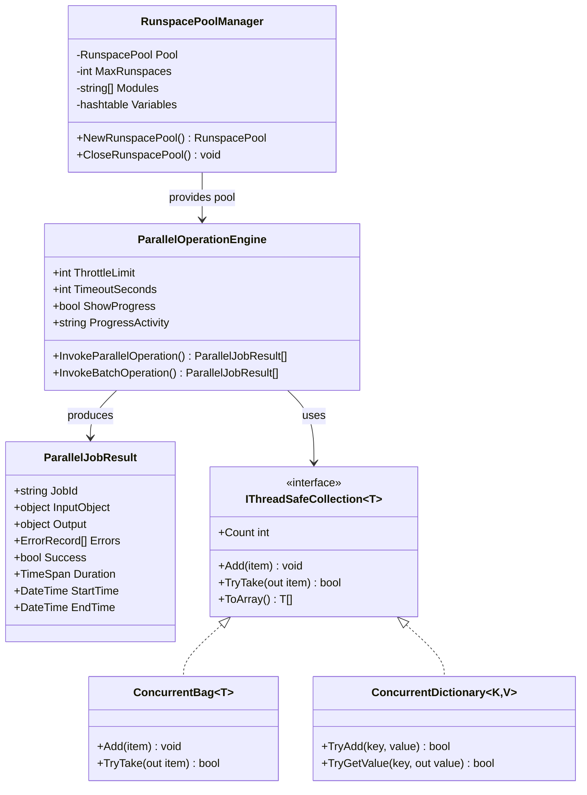

## 6. Sequence Diagram - Forest Root Detection

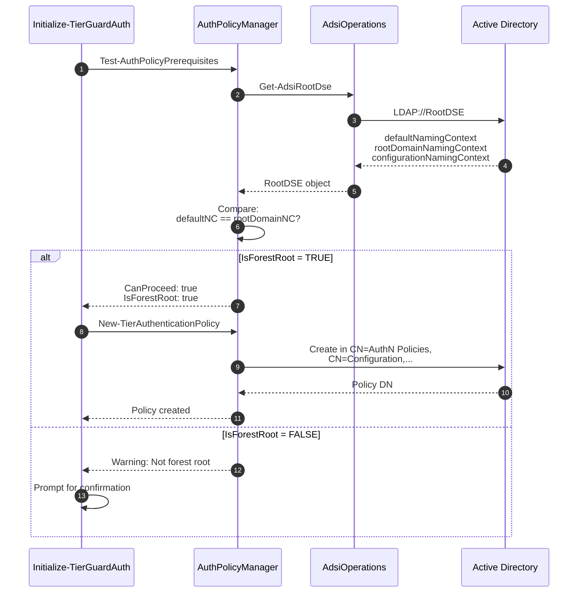

## 7. Sequence Diagram - User Sync Flow

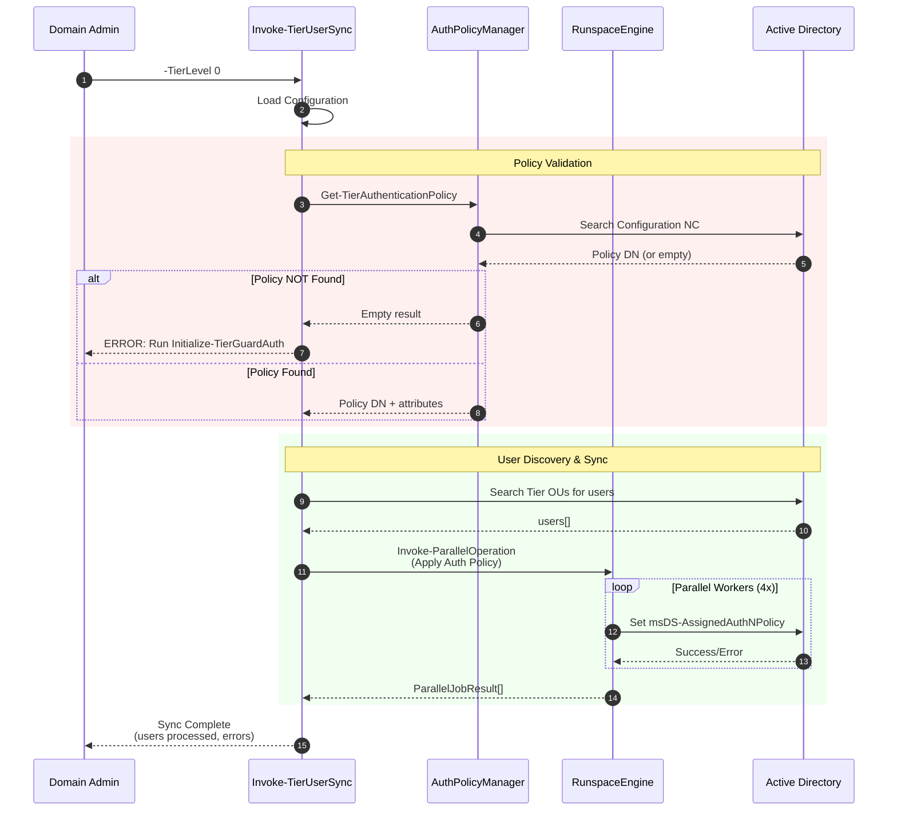

## 8. Sequence Diagram - Runspace Parallel Execution

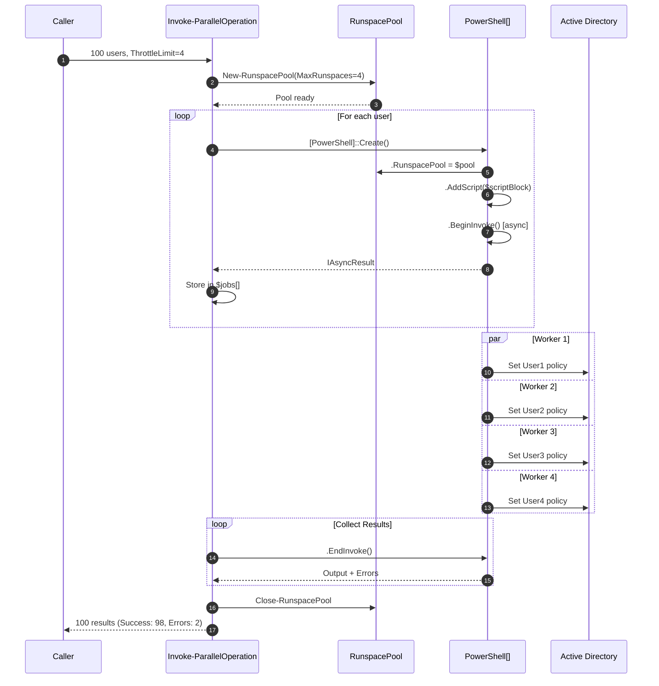

## 9. State Diagram - User Protection States

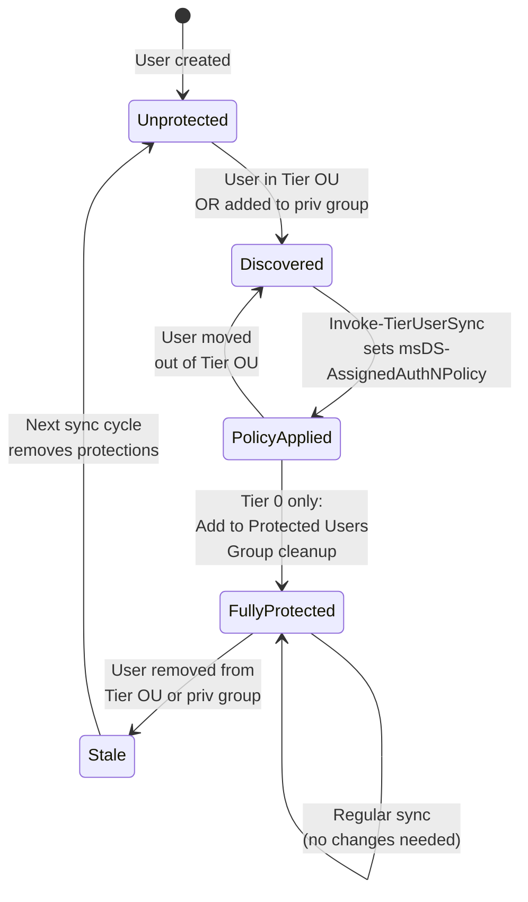

## 10. State Diagram - Authentication Policy Lifecycle

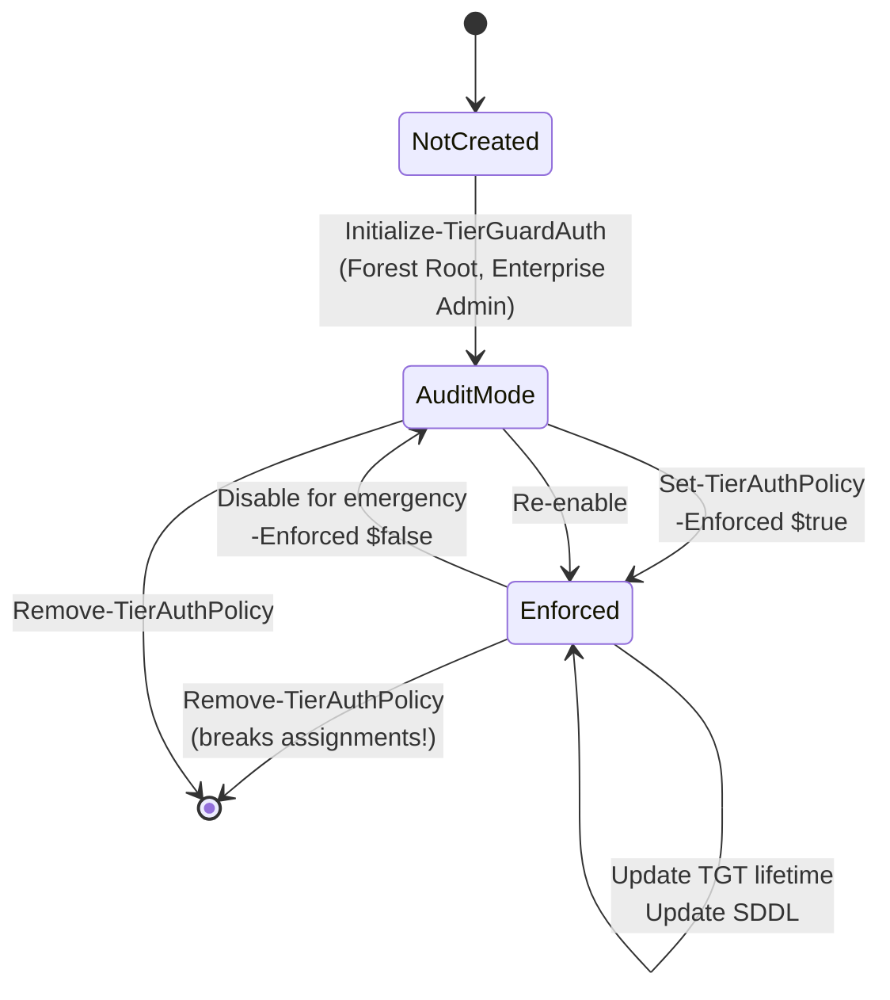

## 11. Activity Diagram - Full Sync Workflow

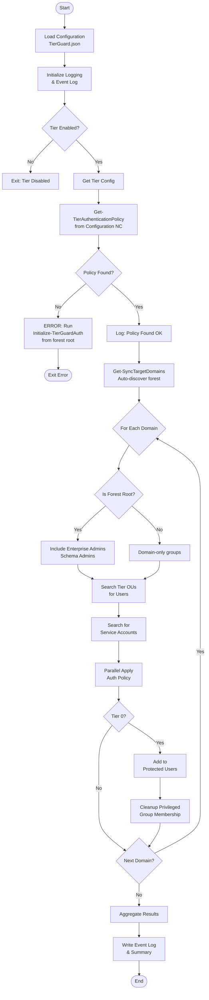

## 12. Activity Diagram - Forest Root Detection

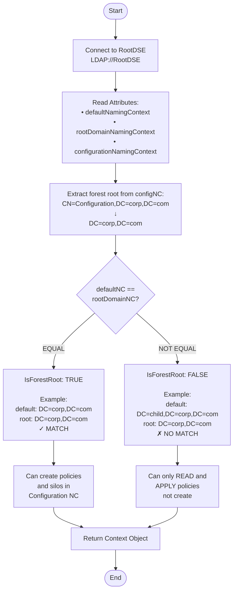

## 13. Deployment Diagram

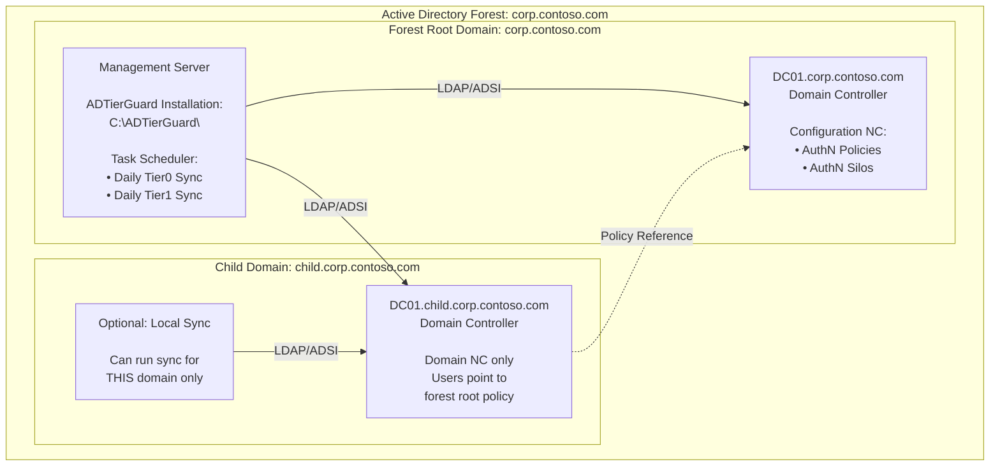

## 14. Data Flow Diagram - Level 1

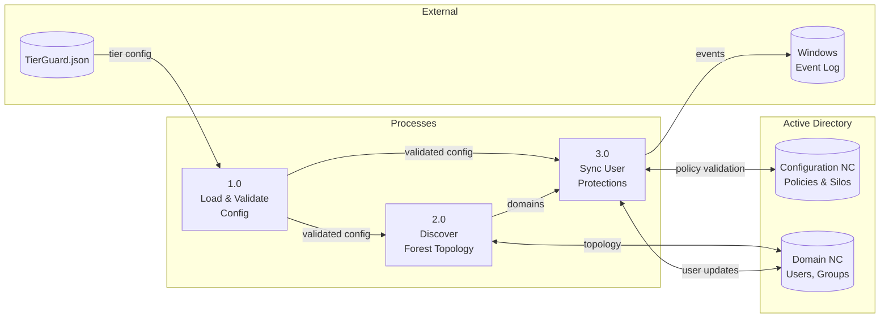
