# ADTierGuard - Architecture & UML Diagrams

## 1. Installation Flow

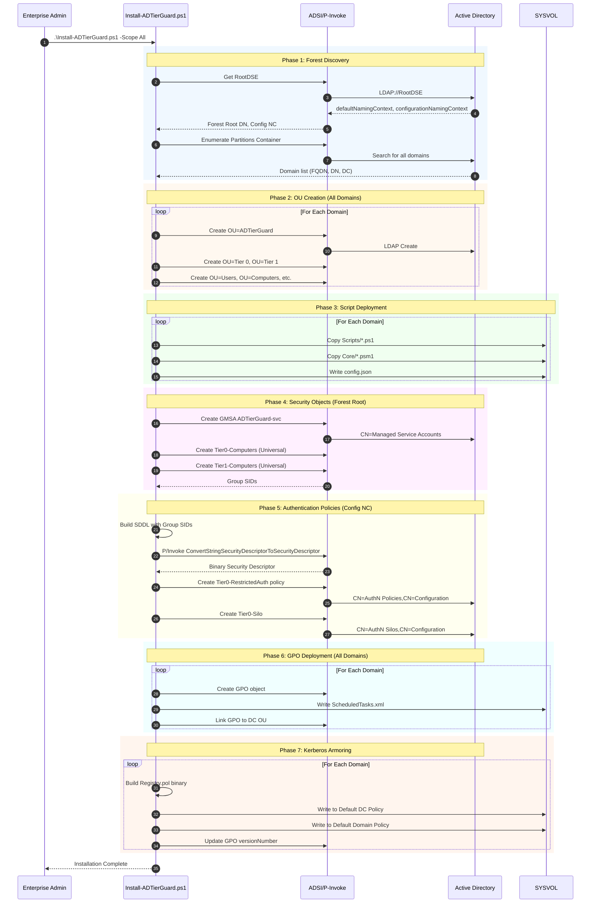

## 2. Component Architecture

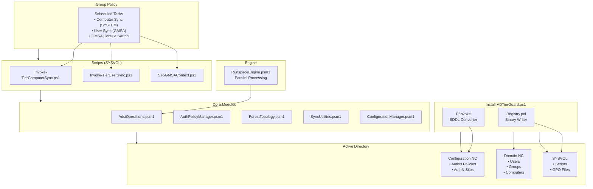

## 3. Authentication Policy SDDL Structure

```mermaid
flowchart LR
    subgraph SDDL["SDDL String"]
        Owner["O:SY<br/>Owner: SYSTEM"]
        Group["G:SY<br/>Group: SYSTEM"]
        DACL["D:"]
    end
    
    subgraph ACE["Conditional ACE (XA)"]
        Type["XA<br/>Callback Allow"]
        Flags["OICI<br/>Inherit"]
        Rights["CR<br/>Control Right"]
        Trustee["WD<br/>Everyone"]
    end
    
    subgraph Condition["Condition Expression"]
        EDCheck["Member_of {SID(ED)}<br/>Enterprise Domain Controllers"]
        OR1[" || "]
        GroupCheck["Member_of_any {SID(...)}<br/>Tier0-Computers Group"]
    end
    
    SDDL --> ACE --> Condition
    
    subgraph Result["Evaluation Result"]
        Allow["✓ TGT Issued<br/>Computer is DC or in Tier0-Computers"]
        Deny["✗ KDC_ERR_POLICY<br/>Computer not authorized"]
    end
    
    Condition --> Result
```

## 4. User Sync Workflow

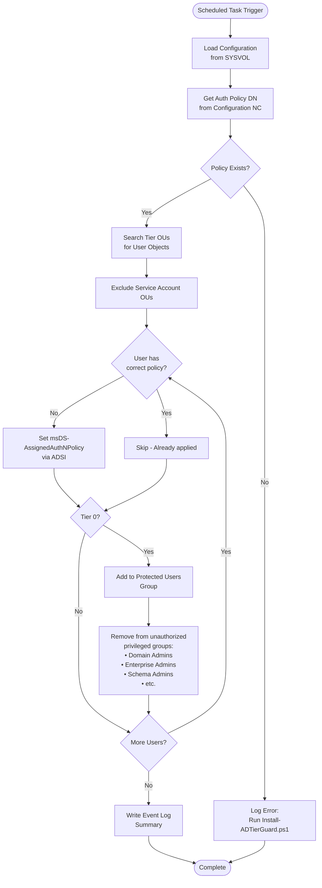

## 5. Computer Sync Workflow

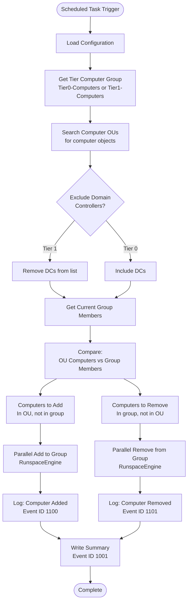

## 6. GMSA Context Switch Flow

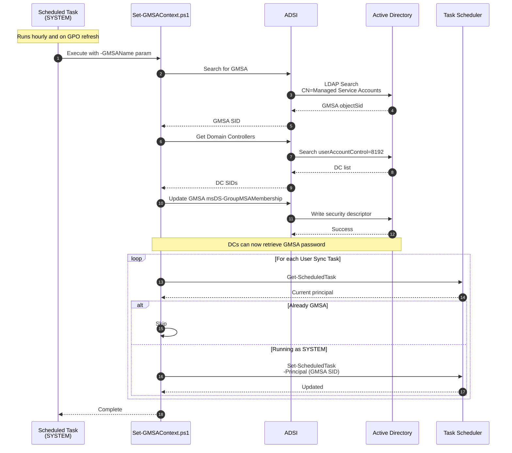

## 7. Kerberos Armoring Registry Settings

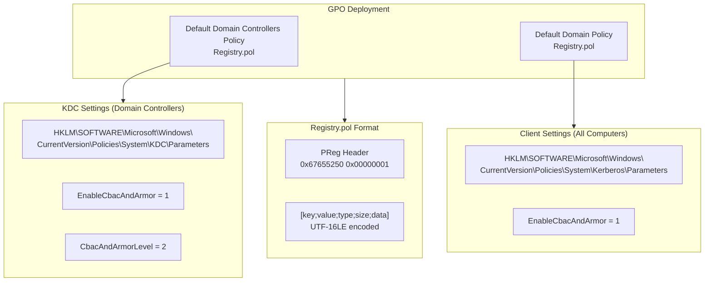

## 8. Forest-Wide Deployment

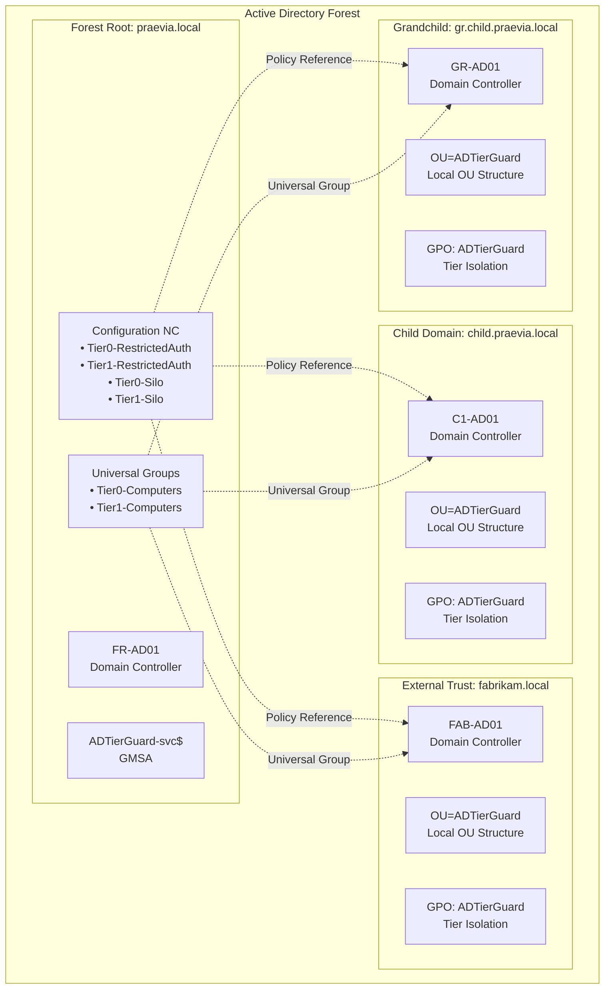

## 9. State Diagram - User Protection

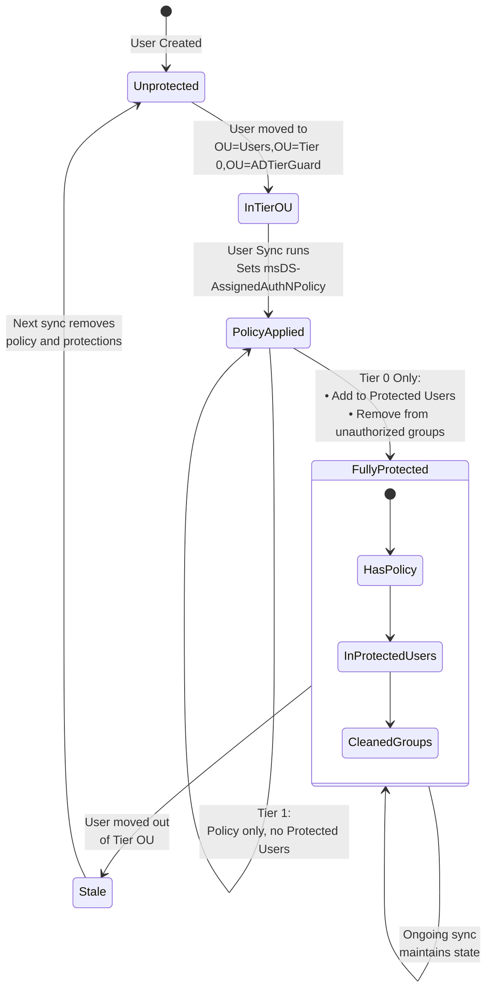

## 10. Scheduled Task Execution Timeline

```mermaid
gantt
    title ADTierGuard Scheduled Tasks - 1 Hour Timeline
    dateFormat HH:mm
    axisFormat %H:%M
    
    section Computer Sync
    Tier 0 Computers    :t0c1, 00:00, 2m
    Tier 1 Computers    :t1c1, 00:05, 2m
    Tier 0 Computers    :t0c2, 00:10, 2m
    Tier 1 Computers    :t1c2, 00:15, 2m
    Tier 0 Computers    :t0c3, 00:20, 2m
    Tier 1 Computers    :t1c3, 00:25, 2m
    Tier 0 Computers    :t0c4, 00:30, 2m
    Tier 1 Computers    :t1c4, 00:35, 2m
    Tier 0 Computers    :t0c5, 00:40, 2m
    Tier 1 Computers    :t1c5, 00:45, 2m
    Tier 0 Computers    :t0c6, 00:50, 2m
    Tier 1 Computers    :t1c6, 00:55, 2m
    
    section User Sync (Disabled by default)
    Tier 0 Users        :crit, t0u1, 00:00, 3m
    Tier 1 Users        :crit, t1u1, 00:00, 3m
    
    section GMSA Context
    GMSA Switch         :gmsa1, 00:00, 1m
```

## 11. OU Structure

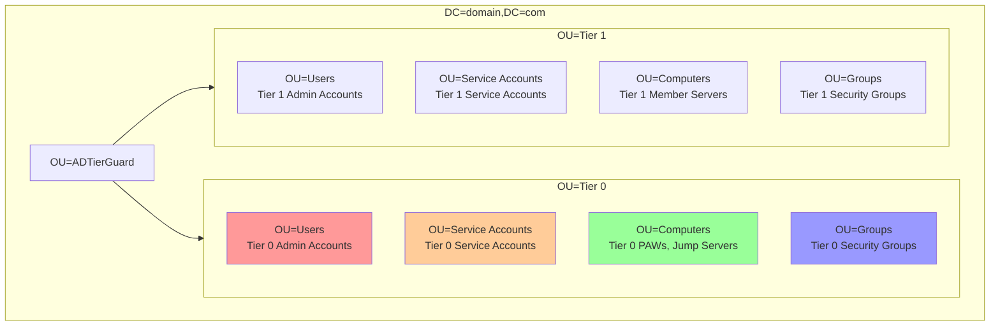

## 12. Event IDs Reference

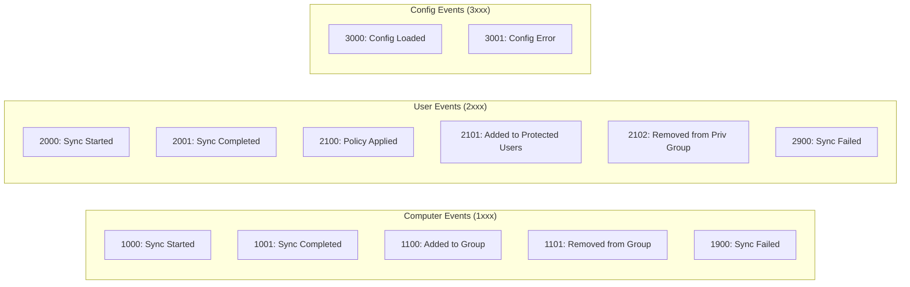
